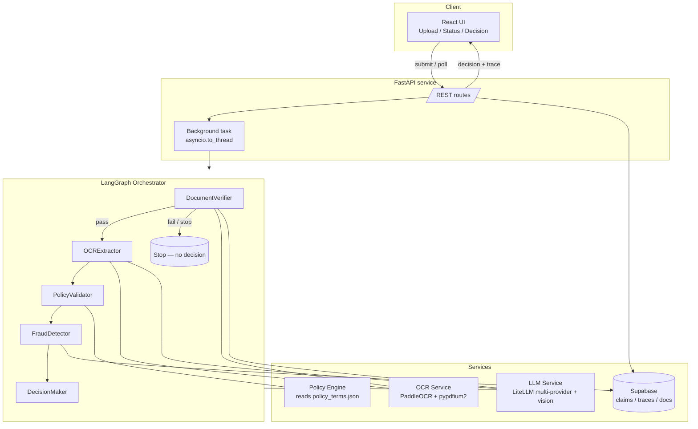

# MediClaim — Architecture Document

## 1. Problem

When an employee submits a health-insurance claim, a human reviewer reads the
uploaded documents (bills, prescriptions, lab reports), checks them against the
member's policy, and decides to **approve, partially approve, reject, or escalate**
the claim. This is slow, inconsistent, and doesn't scale.

MediClaim automates this end to end while keeping every decision **explainable**:
the system extracts structured data from messy real-world documents, validates the
claim against policy rules read from a configuration file, screens for fraud, and
produces a decision with an approved amount, reasons, a confidence score, and a
full execution trace.

---

## 2. High-level architecture



**Stack**
- **Backend:** FastAPI (Python 3.11+)
- **Orchestration:** LangGraph state machine over 5 agents
- **OCR:** PaddleOCR for text; `pypdfium2` for multi-page PDF rendering; optional
  vision-LLM path for handwriting
- **LLM:** LiteLLM (provider-agnostic: OpenRouter / OpenAI / Anthropic / Gemini /
  Ollama), JSON-mode structured extraction
- **Persistence:** Supabase (Postgres + storage)
- **Frontend:** React + Vite + Tailwind

---

## 3. The pipeline and component responsibilities

The pipeline is a **linear LangGraph** with a single conditional edge: if document
verification fails, the graph stops before any decision is made.

| # | Agent | Responsibility | Can stop pipeline? |
|---|-------|----------------|--------------------|
| 1 | **DocumentVerifier** | Classify each document; confirm the right document types are present for the claim category; check readability; check patient-name consistency across documents | **Yes** — stops on missing/wrong/unreadable docs or patient mismatch |
| 2 | **OCRExtractor** | Extract structured fields (patient, doctor, diagnosis, line items, amounts) via OCR + LLM (or vision); validate doctor registration format; surface integrity flags | No — degrades gracefully |
| 3 | **PolicyValidator** | Apply policy rules from `policy_terms.json`: member lookup, waiting periods, per-claim/category/annual limits, exclusions, pre-authorization; compute eligible amount with network discount then co-pay; per-line-item validation | No — degrades gracefully |
| 4 | **FraudDetector** | Score fraud signals: same-day/monthly frequency, high-value, amount anomaly, hospital pattern, document alteration/duplicate stamps; thresholds from policy file | No — degrades gracefully |
| 5 | **DecisionMaker** | Aggregate everything into `APPROVED / PARTIAL / REJECTED / MANUAL_REVIEW` with approved amount, reasons, confidence, and a degradation note when components failed | No — terminal |

**Decision logic (DecisionMaker):**
1. Manual review required (high fraud score, high-value, or any HIGH-severity signal) → `MANUAL_REVIEW`
2. Any policy check **FAILED** → `REJECTED` (with mapped reasons)
3. Some line items rejected, others approved → `PARTIAL`
4. Otherwise → `APPROVED`
Confidence starts at 1.0 and is reduced for failed components and low extraction confidence.

---

## 4. Data flow and state

A single `ClaimState` (a `TypedDict`) flows through all agents. Each agent reads
prior outputs and writes its own results plus a trace entry. Key sections:

- **Input:** claim_id, member_id, category, treatment_date, claimed_amount, document paths
- **Per-agent outputs:** verification_result, extracted_data, policy_validation, fraud_detection, final_decision
- **Cross-cutting:** `trace[]`, `errors[]`, `warnings[]`, `components_executed[]`, `components_failed[]`

> **Design note:** these list fields are plain lists (last-write-wins), not LangGraph
> `add`-reducer channels. The agents mutate the shared lists in place and return the
> full state; an `add` reducer would concatenate the accumulated list onto itself at
> every node, producing duplicate trace entries.

**Request flow:** the API saves uploads outside the reload-watched directory, creates
the claim (in memory + Supabase), and runs the pipeline in a worker thread
(`asyncio.to_thread`) so the event loop stays responsive. The UI polls a status
endpoint (smart backoff) and then fetches the decision + trace.

---

## 5. Failure handling (does it hold up under failure?)

- **Stop-early vs degrade:** only DocumentVerifier stops the pipeline (bad input
  should never reach a decision). Every later agent catches its own exceptions,
  records itself in `components_failed`, and lets the pipeline continue.
- **Graceful degradation:** if extraction fails, policy validation still runs on
  whatever is available; the decision is produced with a **reduced confidence score**
  and a note that manual review is recommended (validated by TC011).
- **LLM resilience:** retries with exponential backoff, JSON-mode with a tolerant
  parser fallback, and a default-safe result on total failure.
- **External-service isolation:** Supabase writes are best-effort and never block
  claim processing.

---

## 6. Observability (can we reconstruct any decision?)

Every agent appends a structured trace entry: agent name, timestamp, duration,
inputs, outputs, and status. The DecisionMaker logs the decision and reasons; the
PolicyValidator logs each check with its result and message; the FraudDetector logs
each signal. The full trace is returned via the API and persisted to Supabase
(`claim_traces`). An audit event is emitted at each major step. The result: a
reviewer can reconstruct exactly **what was checked, what passed/failed, and why**
from the trace alone. `EVAL_REPORT.md` demonstrates this for all 12 cases.

---

## 7. AI integration

- **Structured output:** every extraction uses a per-document JSON schema and
  JSON-mode; responses are validated/parsed defensively.
- **Provider-agnostic:** LiteLLM routes to the configured provider; model names get
  the correct provider prefix so keys are never sent to the wrong backend.
- **Document realism (per `sample_documents_guide.md`):** prompts expand medical
  shorthand (HTN→Hypertension, T2DM→Type 2 Diabetes), instruct best-effort handling
  of handwriting/stamps/multilingual/partial docs, and prefer corrected over
  crossed-out amounts.
- **Optional vision path:** when `LLM_VISION_MODEL` is set, documents (including
  multi-page PDFs) are sent as images to a vision model for handwriting, and the
  model reports integrity flags (crossed-out amounts, duplicate stamps) that feed
  fraud detection.

---

## 8. Considered and rejected

- **Pure-LLM "read everything and decide":** rejected — not explainable or auditable,
  and policy math must be deterministic. We keep policy/fraud logic in code and use
  the LLM only for extraction/classification.
- **Hardcoding policy rules:** rejected — all coverage, limits, exclusions, waiting
  periods, and fraud thresholds are read from `policy_terms.json` so ops can change
  rules without code changes.
- **Vision model as the default OCR:** rejected as default (cost/latency, and the
  provided test docs are printed) but available as an opt-in for handwriting.
- **Exact-substring exclusion matching:** rejected — too brittle (plural/singular,
  "Morbid Obesity" vs "Obesity and weight loss programs"). Replaced with keyword
  matching derived from the policy phrases.

---

## 9. Current limitations

- **In-memory read path:** the API still reads claim status/decision from an
  in-memory dict (writes already go to Supabase). This doesn't survive a restart and
  isn't shared across workers. *(Being addressed: Supabase read-fallback.)*
- **Background processing in-process:** claims are processed in a worker thread, not
  a dedicated queue — fine for the demo, not for sustained load.
- **Handwriting accuracy** depends on the optional vision model; the PaddleOCR text
  path is weak on fully handwritten documents.
- **Visual alteration detection** relies on the vision model / text markers, not
  pixel-level forensics.

---

## 10. Scaling to 10x

| Concern | Today | At 10x |
|---------|-------|--------|
| Claim state | In-memory dict + Supabase writes | Supabase/Redis as the source of truth; stateless API |
| Processing | `asyncio.to_thread` in the web process | Dedicated task queue (Celery / RQ / Arq) with autoscaling workers |
| OCR/LLM cost & latency | Synchronous per claim | Batch + cache, cheaper models for easy docs, vision only when needed |
| Throughput | Single process | Horizontal scale behind a load balancer; idempotent claim IDs |
| Document storage | Local temp + Supabase storage | Object storage (S3) with signed URLs |
| Observability | Logs + Supabase trace | Centralized tracing/metrics (OpenTelemetry), dashboards, alerting |
| Policy changes | Edit `policy_terms.json` | Versioned policy store with effective dates and audit |

The agent boundaries are already clean and stateless per-claim, so moving processing
to a queue and the state to a shared store is the main work — no changes to agent
logic are required.

---

## 11. Repository map

```
backend/app/
  agents/        document_verifier, ocr_extractor, policy_validator,
                 fraud_detector, decision_maker, orchestrator
  services/      ocr_service, llm_service, policy_engine, supabase_client,
                 llm_prompts, medical_validators
  models/        state, claim, policy, document, enums (Pydantic + TypedDict)
  api/           routes, schemas
  config.py      env-driven settings (LLM provider/model, vision, Supabase)
frontend/src/    pages (Upload/Status/Decision), components, hooks, api client
backend/scripts/ generate_eval_report.py, generate_test_documents.py
```
