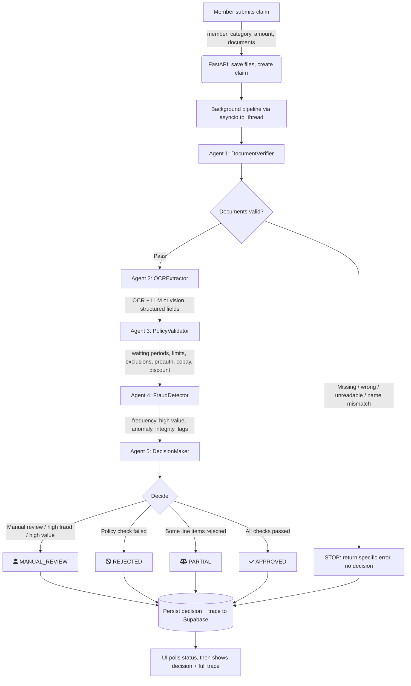

# MediClaim: AI-Powered Medical Claim Processing System

## Overview

MediClaim is an AI-driven medical insurance claim processing platform that automates the complete claim review workflow. Instead of relying on human reviewers to manually inspect medical bills, prescriptions, and policy documents, the system intelligently extracts information, validates policy eligibility, detects fraud, and generates an explainable decision.

Every decision includes:

- Final claim status
- Approved reimbursement amount
- Reasons for the decision
- Confidence score
- Complete execution trace for auditing

The platform combines deterministic business rules with AI-based document understanding to achieve both accuracy and explainability.

---

## Problem Statement

Traditional medical claim processing is slow because every submitted claim must be manually reviewed.

Reviewers typically perform several repetitive tasks:

- Read uploaded bills and prescriptions
- Verify required documents
- Compare the claim against policy rules
- Detect suspicious claims
- Calculate reimbursement
- Produce the final decision

This approach is:

- Time consuming
- Difficult to scale
- Inconsistent between reviewers
- Expensive to operate

MediClaim automates this workflow while ensuring every decision remains fully traceable.

---

## System Architecture

The system consists of three major layers.

### 1. Frontend

**Technology**

- React
- Vite
- Tailwind CSS

Responsibilities:

- Upload claim documents
- Display claim processing status
- Show final decision
- Display complete execution trace

---

### 2. Backend API

**Technology**

- FastAPI
- Python 3.11+

Responsibilities:

- Accept claim submissions
- Store uploaded documents
- Create claim records
- Launch processing pipeline in background worker
- Expose status and result APIs

Background execution keeps the API responsive while OCR and LLM operations run asynchronously.

---

### 3. AI Processing Pipeline

The processing engine is implemented as a LangGraph workflow.

Five independent agents process every claim sequentially.

```
Upload Documents
        │
        ▼
Document Verifier
        │
        ▼
 OCR Extraction
        │
        ▼
Policy Validation
        │
        ▼
 Fraud Detection
        │
        ▼
 Decision Maker
        │
        ▼
 Final Decision
```

---

## Technology Stack

| Layer | Technology |
| --- | --- |
| Frontend | React, Vite, Tailwind |
| Backend | FastAPI |
| Orchestration | LangGraph |
| OCR | PaddleOCR + pypdfium2 |
| Vision OCR | Vision LLM (optional) |
| LLM Routing | LiteLLM |
| Database | Supabase (Postgres + Storage) |
| Language | Python |

---

## Processing Pipeline

### Agent 1 — Document Verifier

**Responsibilities**

- Detect uploaded document types
- Validate required documents
- Check readability
- Verify patient name consistency

**Failure Conditions**

This is the **only** agent capable of terminating the pipeline.

It stops processing if:

- Required documents are missing
- Wrong document type uploaded
- Document unreadable
- Patient names mismatch

---

### Agent 2 — OCR Extractor

**Responsibilities**

Extract structured medical information such as:

- Patient details
- Doctor information
- Diagnosis
- Dates
- Billing items
- Amounts

Additional checks:

- Doctor registration validation
- Document integrity indicators
- Handwriting support via vision model

If extraction fails, the pipeline continues with reduced confidence.

---

### Agent 3 — Policy Validator

Validates extracted claim data against policy rules.

Rules include:

- Member eligibility
- Waiting periods
- Coverage limits
- Category sub-limits
- Annual OPD limits
- Exclusions
- Pre-authorization

Financial calculations:

1. Apply network discount
2. Apply co-pay
3. Calculate eligible reimbursement

Supports partial approval by validating individual bill line items.

---

### Agent 4 — Fraud Detector

Evaluates fraud signals including:

- High claim frequency
- Same-day claims
- High-value claims
- Amount anomalies
- Repeated hospital patterns
- Altered documents
- Duplicate stamps

Fraud thresholds are configurable through the policy configuration.

If the fraud module fails, the claim continues without blocking legitimate users.

---

### Agent 5 — Decision Maker

Combines outputs from all previous agents.

Possible outcomes:

- APPROVED
- PARTIAL
- REJECTED
- MANUAL_REVIEW

Decision priority:

1. Manual Review
2. Rejected
3. Partial Approval
4. Approved

A confidence score is computed based on:

- OCR confidence
- Failed components
- Fraud score

---

## Shared State

All agents communicate using a single `ClaimState` object.

It contains:

**Input Data**

- Claim ID
- Member ID
- Category
- Claimed amount
- Treatment date
- Uploaded document paths

**Agent Outputs**

- Verification results
- OCR results
- Policy validation
- Fraud analysis
- Final decision

**Shared Metadata**

- Trace log
- Errors
- Warnings
- Executed components
- Failed components

Each agent appends its own execution details without interfering with other agents.

---

## Design Principles

### Deterministic vs AI Logic

Business-critical calculations remain deterministic:

- Coverage limits
- Co-pay
- Exclusions
- Waiting periods

AI is used only for:

- OCR
- Document understanding
- Information extraction

This separation guarantees reproducible financial decisions.

---

### Modular Agents

Each agent has a single responsibility.

Benefits:

- Independent testing
- Easy maintenance
- Component replacement
- Clear execution trace

---

### Fail Fast vs Graceful Degradation

Document verification is mandatory.

Therefore:

- Document Verifier stops invalid claims immediately.

Every subsequent agent degrades gracefully.

If one component fails:

- Pipeline continues
- Confidence decreases
- Failure is recorded
- Manual review may be recommended

---

## Error Handling

Only Document Verifier terminates execution.

All remaining agents:

- Catch internal exceptions
- Record failure
- Continue processing
- Reduce confidence

The LLM layer:

- Retries failed requests
- Uses JSON mode
- Falls back to tolerant parsing
- Returns safe defaults when necessary

Supabase persistence is best-effort and never blocks claim processing.

---

## Observability

Every agent records:

- Agent name
- Timestamp
- Execution duration
- Inputs
- Outputs
- Status

Additional logging:

**Policy Validator**

- Every policy check
- Pass/Fail result
- Validation message

**Fraud Detector**

- Fraud signals
- Severity
- Scores

**Decision Maker**

- Final decision
- Approval amount
- Decision reasoning

The execution trace enables complete replay of the decision process.

---

## AI Integration

Structured extraction uses:

- JSON schemas
- JSON mode
- Defensive parsing

LiteLLM allows switching providers:

- OpenAI
- Anthropic
- Gemini
- OpenRouter
- Ollama

Prompt engineering includes:

- Medical abbreviation expansion
- Handwriting handling
- Multilingual text
- Partial document support

Vision models additionally detect:

- Crossed-out text
- Duplicate stamps
- Possible document tampering

---

## Architectural Decisions

Rejected approaches:

### Pure LLM Decision Making

Rejected because:

- Not auditable
- Not deterministic
- Financial calculations become unreliable

---

### Hardcoded Policy Rules

Rejected because policy changes should not require code changes.

Rules are loaded dynamically from configuration.

---

### Vision OCR by Default

Rejected because:

- Higher latency
- Higher cost
- Printed documents work well with PaddleOCR

Vision models remain optional for handwriting.

---

### Exact String Matching

Replaced with keyword-based matching and stopword filtering for better robustness.

---

## Current Limitations

- In-memory claim state does not survive restarts.
- Background processing uses worker threads instead of a dedicated queue.
- Handwriting quality depends on optional vision models.
- Image tampering detection is limited.
- Historical fraud analysis is only partially implemented.

---

## Scaling Strategy

For higher workloads:

- Move claim state to Redis or Supabase
- Replace worker threads with Celery, RQ, or Arq
- Horizontally scale FastAPI
- Store documents in object storage
- Add OpenTelemetry for monitoring
- Version policy configurations with audit history

The existing agent boundaries allow these improvements without changing business logic.

---

## Repository Structure

```
backend/
│
├── app/
│   ├── agents/
│   ├── services/
│   ├── models/
│   ├── api/
│   └── config.py
│
├── data/
│   ├── policy_terms.json
│   └── sample_documents/
│
frontend/
│
└── src/
    ├── upload/
    ├── status/
    └── decision/
```

---

## End-to-End Flow



---

## Key Advantages

- Explainable AI workflow
- Deterministic financial calculations
- Modular LangGraph architecture
- Configurable policy engine
- Fraud-aware decision making
- Complete audit trail
- Easily scalable for production deployment
